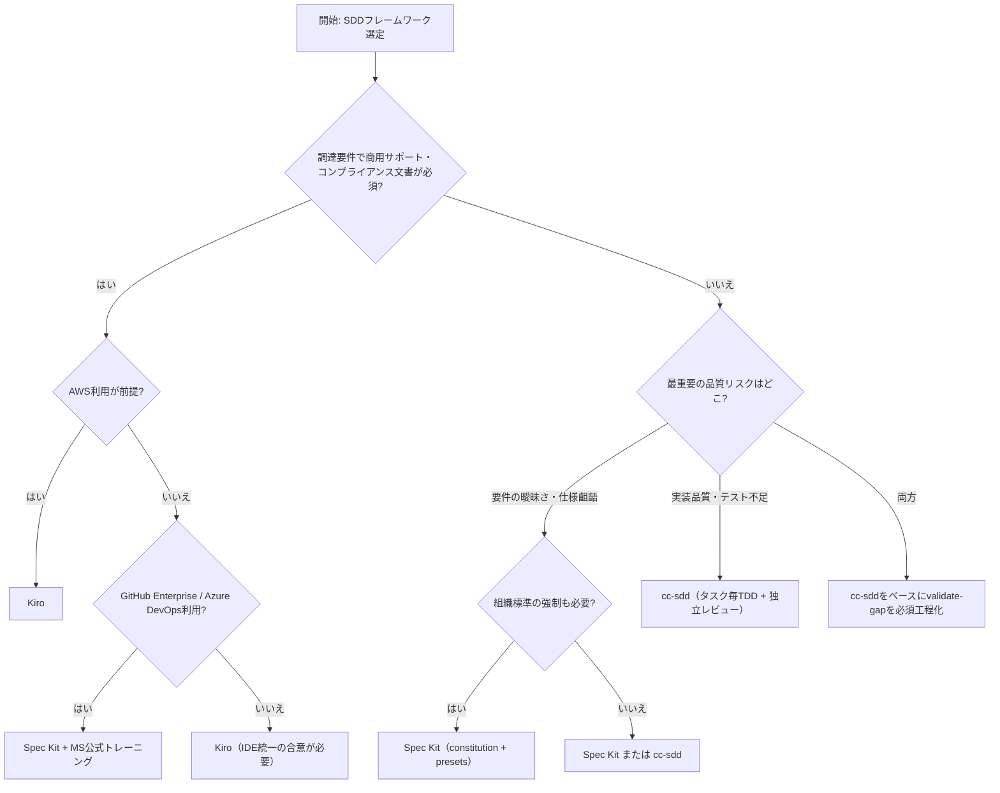

# SDDフレームワーク比較調査: Kiro / cc-sdd / Spec Kit

## このレポートの位置づけ

このレポートは、AI駆動開発におけるSpec-Driven Development（SDD）フレームワークを比較するための技術考察である。

対象は、Kiro、cc-sdd、Spec Kitの3つである。いずれも「要件 → 設計 → タスク → 実装」を段階化し、AIエージェントに渡す仕様を開発プロセスの中心に置く点で共通している。

本稿は、次の3種類の材料を統合している。

1. 公開情報に基づく机上調査
2. 同一要件によるサンプル開発のエミュレーション実証
3. 開発担当者向けのプロセス詳細比較

ここでいう実証は、各フレームワークの実テンプレート・スキル定義・公式ドキュメントに基づいて、同一AIモデルが忠実にプロセスを実行したエミュレーションである。Kiroの製品UI、Agent Hooksの実動作、実サブエージェント並列実行など、製品固有の実機挙動は検証対象外である。

実証ログと生成物は手元の検証資料として保管しているが、公開リポジトリには同梱しない。公開版では、本文中のメトリクスと実験条件のみを掲載する。

## エグゼクティブサマリー

主要SDDフレームワーク3種を比較した結果、単一の勝者は存在しない。3者は同じSDDの骨格を持つが、品質担保の重心が異なる。

| フレームワーク | 品質担保の重心 | 一言で言うと |
|---|---|---|
| Kiro | 製品統合とガバナンス基盤 | AWS系の統合されたSDD開発環境 |
| cc-sdd | 実装フェーズの規律 | タスク毎TDD、独立レビュー、自動デバッグを重視するOSSハーネス |
| Spec Kit | 上流の曖昧性解消と組織標準 | constitutionと品質コマンドで上流品質を強制するツールキット |

エミュレーション実証での最大の発見は、**曖昧要件への対処方式が最終品質を左右した**ことである。

質問を強制する工程を持つcc-sddとSpec Kitは、発注意図を完全に実装した。一方、仮定明示方式のKiroプロセスでは、承認者が仮定を見落とした場合に意図とのギャップが残ることが確認された。

また、コストは「上流の重さ」と「手戻り削減」のトレードオフとして見る必要がある。実証では、上流工程が重いSpec Kitが、手戻りゼロにより相対所要時間では最短となった。これは、高品質要求ドメインでは上流投資が回収されうることを示唆する。

## 第I部 机上調査

## 1. 各フレームワークの概要

### 1.1 Kiro

Kiroは、AWSが提供するエージェンティック開発環境である。KiroのSpecsは、要件、設計、タスクを順に作成し、それをもとに実装へ進む構造化ワークフローを提供する。Kiro Webの公開ドキュメントでは、Feature Specが `requirements.md`、`design.md`、`tasks.md` の3成果物を生成すると説明されている。[^kiro-web-specs]

KiroのFeature Specsには、Requirements-First、Design-First、Quick Planのワークフローがある。Requirements-Firstでは要件から設計とタスクへ進み、Design-Firstでは既存の設計や技術制約から要件とタスクへ進む。Quick Planは、より軽量に計画を作る選択肢として位置づけられる。[^kiro-feature-specs]

Kiroの要件記述では、EARS（Easy Approach to Requirements Syntax）形式が使われる。たとえば `WHEN [condition/event] THE SYSTEM SHALL [expected behavior]` のような形で、検証可能な要件を書く。これは、AIに渡す仕様の曖昧さを減らすうえで重要である。[^kiro-feature-specs]

KiroにはHooksもある。Hooksは、ファイル保存、作成、削除、プロンプト送信、ツール実行前後、spec task実行前後などのイベントに応じて、エージェントプロンプトやシェルコマンドを自動実行する仕組みである。品質チェック、セキュリティ検査、ドキュメント更新などをプロセスへ組み込みやすい。[^kiro-hooks]

料金はクレジット制で、2026年7月確認時点ではFree、Pro、Pro+、Pro Max、Powerなどのプランが公開されている。Freeは50クレジット、Proは月額20ドルで1,000クレジットとされている。[^kiro-pricing]

また、AWSはAmazon Q Developer IDE pluginsとpaid subscriptionsについて、2027年4月30日にサポート終了予定であると発表している。Kiroは、その移行先として説明されている。[^q-eos]

#### Kiroの特徴

- 製品として統合されたIDE/Web/CLI体験
- `requirements.md` / `design.md` / `tasks.md` を中心としたSpecs
- EARSによる検証可能な要件
- Hooksによるプロセス自動化
- AWS契約、課金、管理基盤との接続可能性

#### Kiroの主な論点

- Kiro環境への依存
- クレジット課金によるコスト管理
- IDEやワークフローをチームで統一できるか
- 仮定明示型の要件レビューを承認者が十分に検査できるか

### 1.2 cc-sdd

cc-sddは、gotalabが公開しているOSSのSDDハーネスである。READMEでは、Kiroに着想を得たspec-driven / agentic SDLCスタイルであり、既存のKiro specsと互換・ポータブルであると説明されている。[^cc-sdd]

cc-sdd v3系では、Agent Skillsを中心に再構成されている。Claude CodeとCodexは安定版、Cursor、Copilot、Windsurf、OpenCode、Gemini CLI、Antigravityはベータとして、合計8つのAI coding agentに対応すると説明されている。[^cc-sdd]

ワークフローは、discovery、requirements、design、tasks、implementationへ進む。特に特徴的なのは実装フェーズである。`/kiro-impl` では、各タスクごとに新しい実装者がTDD（RED → GREEN）をフィーチャーフラグ下で実行し、独立レビュアーが確認する。実装者が詰まった場合やレビューで2回却下された場合、自動デバッグパスがクリーンなコンテキストで根本原因を調査する。[^cc-sdd]

また、cc-sddはBoundary-first spec disciplineを掲げている。`design.md` のFile Structure Planがタスク境界を駆動し、tasksには `_Boundary:_` と `_Depends:_` 注釈が付く。レビューではスタイルだけではなく、境界違反を検査する。[^cc-sdd]

#### cc-sddの特徴

- Kiro風SDDを複数エージェントで使えるOSSハーネス
- タスク毎のTDD、独立レビュー、自動デバッグ
- Boundary-firstによる責任境界の明確化
- `/kiro-spec-batch` による複数specの並行分解とクロスレビュー
- 既存のKiro specsとの互換性

#### cc-sddの主な論点

- OSSメンテナンス体制の継続性
- エージェントCLIやサブエージェント運用への習熟
- 実装規律が強いぶん、トークン・時間消費が増えうる
- 企業調達でベンダーサポート契約が必要な場合の扱い

### 1.3 Spec Kit

Spec Kitは、GitHubが公開しているSDDツールキットである。GitHubのREADMEでは、任意のAI coding agentで高品質なソフトウェアを作るためのオープンソースツールキットと説明されている。[^spec-kit]

Spec Kitの中心にはSpecify CLIがある。`specify init` により、SDD用のテンプレートやエージェント向けプロンプトをプロジェクトへスキャフォールディングする。Microsoftの解説では、Specify CLIはPythonベースで、uvを使って導入する例が示されている。[^ms-spec-kit-blog]

Spec Kitは、`constitution.md` を重視する。constitutionは、品質基準、テスト方針、UXやパフォーマンス、技術判断の原則など、プロジェクトで守るべき非交渉原則を定義する文書である。これは、エージェントが以後の仕様化、計画、実装で参照する組織標準として機能する。[^spec-kit]

コマンド体系としては、`/speckit.constitution`、`/speckit.specify`、`/speckit.plan`、`/speckit.tasks`、`/speckit.implement` が中心である。追加の品質検証として、`/speckit.clarify`、`/speckit.analyze`、`/speckit.checklist` も提供される。`/speckit.taskstoissues` により、タスクをGitHub Issuesへ変換することもできる。[^spec-kit]

Spec Kitは30以上のAI coding agent integrationをサポートすると説明されており、エージェントロックインを避けたい組織に向く。[^spec-kit]

#### Spec Kitの特徴

- GitHub公式のOSS SDDツールキット
- constitutionによる組織標準の明文化
- clarify / analyze / checklistによる上流品質チェック
- presets / extensionsによるカスタマイズ
- 30以上のAI coding agent integration
- GitHub Issuesとの接続

#### Spec Kitの主な論点

- コマンド数と成果物数が多く、学習コストがある
- 実装フェーズのTDDや独立レビューは、cc-sddほど強く組み込まれていない
- 大規模モノレポでは仕様ファイルの肥大化に注意が必要
- 組織標準をconstitutionにどう書くかが成果に大きく影響する

## 2. 比較軸別の評価

### 2.1 総合比較表

評価は公開情報に基づく机上評価である。導入判断では、実プロジェクトでのPoCが必要である。

| 比較軸 | Kiro | cc-sdd | Spec Kit |
|---|---|---|---|
| 提供形態 | 商用開発環境 | OSSハーネス | OSSツールキット |
| 要件の厳密性 | ◎ EARS形式 | ◎ EARS形式 | ○ ユーザーストーリー＋受入基準、presetで強化可能 |
| 承認ゲート | ◎ Specsの段階的レビュー | ◎ フェーズゲートで契約を承認 | ○ フェーズ区切りはあるが運用依存 |
| 実装の自律性・規律 | ○ task実行とHooks | ◎ タスク毎TDD＋独立レビュー＋自動デバッグ | △ implementはあるが規律はタスク計画・運用依存 |
| トレーサビリティ | ◎ 3成果物体系 | ◎ 3成果物＋境界・依存注釈 | ◎ analyze/checklist、Issues連携 |
| 組織標準の強制 | ○ steering / hooks 等で対応 | ○ templates/rulesで対応 | ◎ constitution＋presets |
| ロックイン | △ Kiro環境前提 | ◎ 複数エージェント対応 | ◎ 30+ integration |
| 成熟度・サポート | ◎ AWS製品 | △ OSS、体制は確認が必要 | ○ GitHub公式OSS＋Microsoft Learn |
| コスト | クレジット制 | ツール自体は無料、エージェント費用別 | ツール自体は無料、エージェント費用別 |
| 大規模並行開発 | ○ チーム共有spec | ◎ spec-batch＋クロスレビュー | ○ タスク並列化やIssues連携は可能、仕様肥大化に注意 |

### 2.2 開発生産性

3者とも実装前に要件・設計・タスクを明示する。これは手戻りを減らす可能性がある一方、軽微な変更では過剰になることもある。

KiroはQuick Planにより軽量化できる。cc-sddはKiro風の3成果物を中心にしつつ、実装フェーズの規律が厚い。Spec Kitはconstitution、spec、plan、tasksに加え、clarify、analyze、checklistなどを使うと工程数が多くなる。

cc-sddは、実装フェーズの自動化と規律が最も強い。タスク毎に実装、テスト、レビュー、デバッグを繰り返す設計は、欠陥コストが高い開発に向きやすい。

Kiroは、SpecsとHooksにより、計画とイベント駆動の自動化を統合する。Spec Kitは、上流の仕様化と組織標準の埋め込みに強いが、実装中のTDD・レビュー規律は運用設計に依存する。

### 2.3 規制産業適合性

この節は机上評価であり、実際の金融・自治体・防衛領域での調達事例や監査合格事例を確認したものではない。

| 観点 | Kiro | cc-sdd | Spec Kit |
|---|---|---|---|
| 監査証跡 | SpecsをGit管理しやすい。AWS契約・管理基盤との接続が期待できる | Markdown specsとImplementation NotesをGit管理しやすい | specs、tasks、Issues連携で監査プロセスに乗せやすい |
| 要件の検証可能性 | EARS形式が強い | EARS形式と境界注釈が強い | checklist/analyzeとpresetで強化可能 |
| 組織標準 | 製品機能とHooks等で対応 | templates/rulesで対応 | constitution/presetsで明示的に強制しやすい |
| 調達・サポート | AWS製品として扱える可能性 | OSSのため別途サポート設計が必要 | GitHub公式OSS。企業導入ではGitHub Enterprise等との組み合わせを検討 |
| データ主権 | Kiro/AWSの契約・設定に依存 | 利用するエージェント/LLMに依存 | 利用するエージェント/LLMに依存 |

規制産業で重要なのは、ツール名そのものよりも、要件、設計、実装、テスト、レビュー、承認、変更履歴が追跡可能であることだと考えられる。その意味で、3者ともSDDの構造は有利に働きうるが、実際の適合性は運用ルールと証跡設計に依存する。

## 第II部 サンプル開発によるエミュレーション実証

## 3. 実験設計

### 3.1 題材

題材は、チーム用タスク管理Web APIである。Python/Flaskを想定し、CRUD、ステータス遷移制御、期限管理、アーカイブ、操作履歴を含めた。

発注書には、意図的に次の曖昧要件を混入した。

1. 期限切れの可視化手段
2. アーカイブの権限とアーカイブ後の扱い
3. 履歴の対象、粒度、保持期間

真の意図は共通回答表として用意し、質問された場合のみ開示した。

### 3.2 方式

各フレームワークの実テンプレート・プロセス定義を取得し、同一AIモデルが忠実に実行するエミュレーションとして比較した。

- cc-sdd: `npx` により実インストールしたテンプレート・スキル定義を使用
- Spec Kit: 公式テンプレートを使用
- Kiro: 公式ドキュメントのSpecs形式を使用

承認ゲートは、固定ペルソナのレビュアーが同一チェックリストで審査すると仮定した。

### 3.3 計測

計測には、pytest、coverage、radon、ruff、フェーズ別時刻、成果物文字数、工程数、質問回数、手戻り回数を用いた。

トークン消費は直接メータリングできなかったため、成果物文字数、工程数、相対所要時間をproxyとして扱った。

## 4. 実測結果

### 4.1 品質

| メトリクス | Kiro | cc-sdd | Spec Kit |
|---|---:|---:|---:|
| テスト数（全パス） | 22 | **29** | 23 |
| テストカバレッジ | 98% | **99%** | **99%** |
| 平均循環的複雑度 | 2.71 | **2.23** | 3.00 |
| ruff違反 | 2 | **0** | **0** |
| 実装中の手戻り | 1回 | 1回（レビューが仕様欠陥検出） | **0回（実装前検出）** |
| 発注意図とのギャップ | **2件残存** | **0件** | **0件** |

### 4.2 生産性・コスト

| メトリクス | Kiro | cc-sdd | Spec Kit |
|---|---:|---:|---:|
| 実装コードLOC | 238 | 264 | **218** |
| テストLOC | 139 | **226** | 142 |
| 仕様ドキュメント文字数 | 5,228 | **4,337** | 5,193 |
| 生成ドキュメント数 | 3 | 4 | **5** |
| 発注者への質問 | 0（仮定明示） | **3** | **3** |
| 相対所要時間 | 156秒 | 189秒（+21%） | **140秒（-10%）** |
| プロセス工程数 | 6 | 9（TDD往復含む） | 8 |

所要時間・文字数は同一実行環境での相対比較専用であり、絶対性能としては扱わない。

## 5. 最重要の発見: 曖昧要件の扱いが品質を分けた

### 5.1 Kiro

KiroのRequirements-Firstに相当するプロセスでは、質問せず仮定を明示して承認を求める方式になった。

仮定は文書化されたが、承認者がその仮定を十分に検査しなかった場合、真の意図とのギャップが残った。今回のエミュレーションでは、アーカイブは復元可能であること、削除後も履歴を参照できることという意図に対して、restore機能の欠落と削除後履歴の404という2件のギャップが残った。

これは、Kiroが弱いというより、仮定明示方式では承認者のレビュー品質が成果物品質に直結することを示している。

### 5.2 cc-sdd

cc-sddでは、validate-gapに相当する質問工程により、3件の曖昧要件が質問され、回答が仕様に反映された。

さらに、実装中の独立レビューが「削除後の履歴参照が404になる」欠陥を検出し、修正された。上流の質問と実装中レビューが二重に機能したと解釈できる。

### 5.3 Spec Kit

Spec Kitでは、clarifyにより3件の曖昧要件が構造化質問として扱われ、Clarificationsに記録された。

さらに、analyzeが実装前に「削除後履歴のエッジケースがテスト計画にない」ことを検出し、手戻りゼロで実装が完了した。

### 5.4 示唆

高品質ドメインでは、「質問を強制する工程」の有無が発注意図とのギャップに直結しうる。

仮定明示方式は、承認者が仮定を精査できる場合には有効である。しかし、承認者が忙しい、仕様に十分詳しくない、または仮定のリスクを見落とす場合には、質問強制型のプロセスの方が安全に働く可能性がある。

## 6. プロセス特性の実測所感

### 6.1 cc-sdd

タスク毎TDDと境界注釈により、lint違反ゼロ、最低複雑度、最厚テストを達成した。一方、工程数と相対時間は最大であり、実装フェーズのコストは増えやすい。

欠陥コストが高い領域では、この追加コストは正当化されうる。

### 6.2 Spec Kit

constitution、clarify、analyzeにより上流工程は重いが、実装前に欠陥を検出し、手戻りゼロとなった。

「上流が重いほど遅くなる」という単純な仮説とは逆に、今回の小規模題材では総所要時間が最短になった。上流の欠陥検出が、後工程の手戻りを消したためと考えられる。

### 6.3 Kiro

Kiro相当プロセスは軽量で速いが、質問工程がない分、承認者がリスクを負う。

ただし、今回の実証ではKiroのAgent HooksやIDE統合などの実製品機能を対象外としている。そのため、実製品ではこの結果より品質側に寄る可能性がある。

## 7. エビデンスの扱い

全成果物（各runの仕様書、設計書、コード、テスト、pytest、coverage、radon、ruffのログ、タイムライン）は、手元の検証資料として保存している。

ただし、生成コードやログには環境情報、ローカルパス、ツール出力などが含まれうるため、公開リポジトリにはエビデンス一式を同梱しない。公開する場合は、別途サニタイズと再現用パッケージ化を行う。

## 第III部 開発担当者視点の詳細比較

## 8. SDLC工程マッピング

従来工程との対応を整理すると、各フレームワークが「どの工程をツールの工程にするか」が見えてくる。

| 従来工程 | Kiro | cc-sdd | Spec Kit |
|---|---|---|---|
| プロジェクト規約策定 | steering | `kiro-steering` | `/speckit.constitution` |
| 要件定義 | requirements.md生成→承認 | `kiro-spec-requirements`→承認 | `/speckit.specify` |
| 要件レビュー・曖昧性解消 | 承認時に仮定を検査 | `kiro-validate-gap` | `/speckit.clarify` |
| 基本設計 | design.md生成→承認 | `kiro-spec-design`→承認 | `/speckit.plan` |
| 詳細設計・タスク分割 | tasks.md生成→承認 | `kiro-spec-tasks`→承認 | `/speckit.tasks` |
| 設計検証 | 承認ゲート中心 | `kiro-validate-design` | `/speckit.analyze` |
| 実装 | タスク逐次実行 | `kiro-impl`で自律実行 | `/speckit.implement` |
| 単体テスト | 実装タスクに含む | テスト先行を強制 | タスク計画・constitution次第 |
| コードレビュー | 人間がdiff確認 | 独立レビュアーsubagent＋人間 | 人間のPR運用 |
| デバッグ | 人間＋エージェント対話 | auto-debug | 人間＋エージェント対話 |
| 進捗管理 | tasks.md | tasks.md＋Implementation Notes | tasks.md / GitHub Issues |

3者とも1フィーチャー内では「要件 → 設計 → 実装」のミニウォーターフォールに近い。ただしフィーチャー単位で反復するため、全体としてはアジャイル的に扱える。

Spec Kitはユーザーストーリーごとの独立実装・独立テスト可能性を重視するため、3者の中で最もインクリメンタル志向である。cc-sddはspec承認後の自律実行が長いため、「仕様までは反復的、実装はバッチ」という感覚に近い。

## 9. 開発者の1日

### 9.1 Kiroの場合

Kiroでは、開発者はIDE上で機能要望を書き、生成されたrequirements、design、tasksを順に読む。開発者の仕事はコーディングそのものより、仮定と受入基準を検査し、承認することへ寄る。

実証では、仮定を見落とすと欠陥が残った。したがってKiroでは、承認者が `仮定` と `未確認事項` を精査する運用が品質の中心になる。

開発者の感覚は「レビュアー兼承認者」に近い。

### 9.2 cc-sddの場合

cc-sddでは、開発者はdiscovery、requirements、design、tasksの各コマンドを進め、曖昧点に回答し、specを承認する。

`kiro-impl` に入ると、タスク毎に実装者、テスト、独立レビュー、自動デバッグが回る。開発者は実装作業そのものより、仕様合意と最終検収に集中する。

開発者の感覚は「仕様の共同執筆者＋最終検収者」に近い。

### 9.3 Spec Kitの場合

Spec Kitでは、開発者は最初にconstitutionを作り、品質原則や技術判断の基準を明文化する。その後、specify、clarify、plan、tasks、analyze、implementを進める。

読む量は3者で最も多いが、上流の品質検査が厚い。実装後の品質保証は、CIやPRレビュー文化に依存する。

開発者の感覚は「仕様アーキテクト」に近い。

## 10. 規約・ポリシーの比較

### 10.1 要件記述

| | Kiro | cc-sdd | Spec Kit |
|---|---|---|---|
| 記法 | EARS | EARS | Given/When/Then受入シナリオ＋FR番号 |
| 構造規約 | ユーザーストーリー＋受入基準 | 要件ID、Boundary Context | ユーザーストーリー優先度、独立テスト可能性 |
| 曖昧さの扱い | 仮定を明示して承認に委ねる | validate-gapで質問 | `[NEEDS CLARIFICATION]`→clarify |

### 10.2 設計・実装

| | Kiro | cc-sdd | Spec Kit |
|---|---|---|---|
| 設計文書 | design.md | design.md＋File Structure Plan | plan.md＋research.md＋data-model.md＋contracts |
| 変更範囲の統制 | タスク記述 | `_Boundary:_` 注釈 | タスクに正確なファイルパス |
| 実装の進め方 | タスク逐次 | 1タスク=1subagent | フェーズ順、`[P]`は並列可 |
| 組織標準の注入点 | steering | templates/rules | constitution＋presets |

### 10.3 テスト・レビュー

| | Kiro | cc-sdd | Spec Kit |
|---|---|---|---|
| テスト方針 | タスクに含める。順序は任意 | TDD強制 | constitutionやタスク計画次第 |
| コードレビュー | 人間 | 毎タスク独立レビュアーsubagent＋人間 | 人間のPR運用 |
| 失敗時の扱い | 人間が対話で修正 | 2回リジェクト→auto-debug | 人間が対話で修正 |

### 10.4 承認・変更管理

- Kiro: フェーズ毎のUI承認。Quick Planでゲートを省略可能。
- cc-sdd: 承認状態がspec.jsonに記録され、未承認specでは実装が止まる。
- Spec Kit: ゲートは運用依存。ただしclarify/analyzeの記録がspecに残り、事後監査しやすい。

## 11. 開発者体験の評価

| 観点 | Kiro | cc-sdd | Spec Kit |
|---|---|---|---|
| 学習コスト | 低。IDEが誘導 | 中。skills習得が必要 | 高。CLI/uv/コマンド体系の理解が必要 |
| 開発者の裁量 | 中 | 低〜中 | 高 |
| 待ち時間 | タスク毎に細切れ | `kiro-impl`中はまとまった待ち | implement後にまとめて検証 |
| 認知負荷の中心 | 仮定の検査 | 上流の仕様合意 | 上流文書の執筆・整合性維持 |
| 既存ワークフローとの馴染み | IDE移行が必要 | 既存エージェントに追加 | Git/PR/Issues文化と好相性 |

どのツールでも、開発者の主戦場はコーディングから「仕様の読み書きと検収」へ移る。Kiroでは承認の質、cc-sddでは要件合意の質、Spec Kitではconstitutionの設計が、それぞれ成果物品質の支配要因になる。

## 第IV部 選定判断ガイド

## 12. デシジョンマトリクス

評価は、◎=3、○=2、△=1としている。重みは高品質要求ドメインの例であり、自組織の優先度に合わせて差し替えるべきである。

| 判断基準 | 重み | Kiro | cc-sdd | Spec Kit |
|---|---:|---:|---:|---:|
| 要件の厳密性・検証可能性 | 15% | 3 | 3 | 2 |
| 曖昧要件の解消メカニズム | 15% | 1 | 3 | 3 |
| 実装フェーズの品質規律 | 15% | 2 | 3 | 1 |
| 組織標準・規制要件の強制 | 10% | 2 | 2 | 3 |
| トレーサビリティ・監査証跡 | 10% | 3 | 3 | 3 |
| ベンダーサポート・調達適合性 | 10% | 3 | 1 | 2 |
| ロックイン回避・環境自由度 | 10% | 1 | 3 | 3 |
| 導入・学習コスト | 5% | 2 | 3 | 1 |
| 開発総コスト | 5% | 1 | 2 | 2 |
| 大規模並行開発スケール | 5% | 2 | 3 | 2 |
| 加重合計 | 100% | 2.05 | 2.65 | 2.25 |

この重み付けではcc-sddが最高得点になる。ただし、ベンダーサポート・調達適合性の重みを上げるとKiroとの差は縮まる。マトリクスは結論ではなく、組織の優先順位を可視化する道具である。

## 13. 選定フローチャート

## 14. シナリオ別推奨

### 金融（勘定系・決済系）

第一候補はcc-sdd。TDD強制と独立レビューが、欠陥コストの高いドメインに直結する。調達でベンダーサポートが必須なら、Kiroを採用し、レビュー工程を厳格化する選択肢がある。

### 自治体・公共

第一候補はSpec Kit。constitution/presetsで内部統制・調達標準を埋め込みやすく、Issues連携で監査証跡を残しやすい。

### 防衛・ミッションクリティカル

Kiroまたはcc-sdd＋厳格カスタムが候補になる。サプライチェーン審査が重要な場合、OSSで実行環境を選べるcc-sddをオンプレ・閉域LLMと組み合わせる選択肢がある。

### 大規模SIの複数ベンダー混成チーム

Spec Kitが有力。ロックインを抑えつつ、仕様形式を統一しやすい。ただし、巨大モノレポでは仕様分割の設計が必要である。

### AWS中心の内製組織

Kiroが有力。AWS契約・請求統合、職能横断でのspec共有、Agent Hooksが活きる。曖昧要件対策として、承認前に仮定リストを発注者と読み合わせる運用ルールを追加したい。

## 15. 実務チェックリスト

1. 自組織の欠陥コストを見積もり、上流・実装規律への投資額と比較したか
2. 曖昧要件の解消責任を、ツールの質問工程に置くか、承認者の検査に置くか決めたか
3. デシジョンマトリクスの重みを自組織の優先度で再設定したか
4. パイロットプロジェクトで自組織の数値を実測する計画があるか
5. OSS採用時、メンテナンス停止時の出口戦略を確認したか
6. Kiro採用時、仮定明示のレビュー運用を明文化したか
7. Spec Kit採用時、constitutionにテスト必須・品質基準・例外条件を明記したか
8. cc-sdd採用時、サブエージェント実行コストと待ち時間を許容できるか確認したか

## 16. 本調査の限界

- サンプル開発はエミュレーション方式であり、製品固有機能の実動作は検証していない。
- KiroのAgent Hooks、IDE統合、承認UIは実機検証していない。
- 小規模題材（約220〜260 LOC）であり、大規模スケール性は文献知見と推論で補完している。
- トークン消費は直接メータリングできなかったため、文字数、工程数、時間をproxyとした。
- 各ツールは活発に更新中であり、本レポートは2026年7月時点のスナップショットである。

## 17. まとめ

Kiro、cc-sdd、Spec KitはいずれもSDDを支援するが、同じ問題を同じ角度から解いているわけではない。

- Kiroは、製品として統合されたSDD体験を提供する。
- cc-sddは、実装フェーズの規律をOSSハーネスとして強化する。
- Spec Kitは、組織標準と上流品質をエージェント非依存に埋め込む。

SDDフレームワークを選ぶときは、「どれが最も優れているか」ではなく、次の問いで選ぶべきである。

- 仕様を誰が承認するのか
- 曖昧要件を質問で潰すのか、仮定明示で進めるのか
- 実装フェーズの規律をどこまで自動化したいのか
- 組織標準をどの程度プロセスに埋め込みたいのか
- エージェントやIDEのロックインをどこまで許容するのか
- 監査証跡や調達要件をどの程度重視するのか
- 上流コストと後工程の手戻り削減をどう評価するのか

現時点では、Kiroは「製品統合」、cc-sddは「実装規律」、Spec Kitは「組織標準」という軸で整理すると理解しやすい。

## 参考資料

[^kiro-web-specs]: [Specs - Web - Docs - Kiro](https://kiro.dev/docs/web/specs/)

[^kiro-feature-specs]: [Feature Specs - IDE - Docs - Kiro](https://kiro.dev/docs/specs/feature-specs/)

[^kiro-hooks]: [Hooks - IDE - Docs - Kiro](https://kiro.dev/docs/hooks/)

[^kiro-pricing]: [Pricing - Kiro](https://kiro.dev/pricing/)

[^q-eos]: [Amazon Q Developer end-of-support announcement - AWS DevOps & Developer Productivity Blog](https://aws.amazon.com/blogs/devops/amazon-q-developer-end-of-support-announcement/)

[^cc-sdd]: [gotalab/cc-sdd - GitHub](https://github.com/gotalab/cc-sdd)

[^spec-kit]: [github/spec-kit - GitHub](https://github.com/github/spec-kit)

[^ms-spec-kit-blog]: [Diving Into Spec-Driven Development With GitHub Spec Kit - Microsoft for Developers](https://developer.microsoft.com/blog/spec-driven-development-spec-kit)
