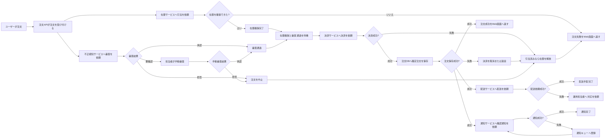
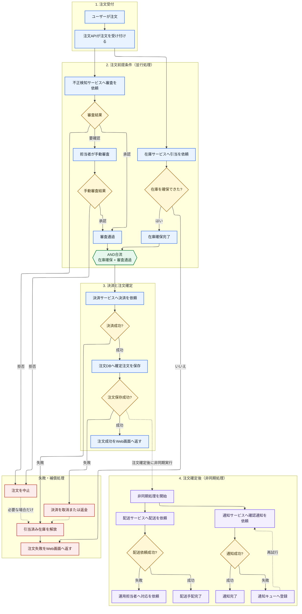
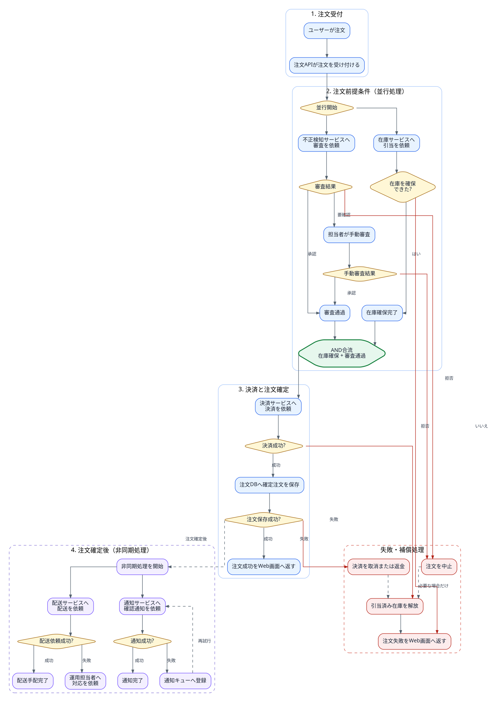
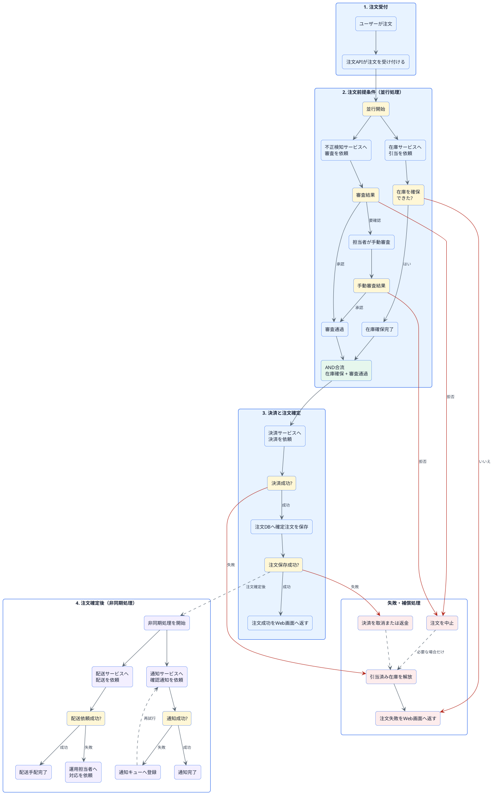

# AI駆動開発における見た目まで考慮した図の記述方針

## このレポートの位置づけ

このレポートは、AI駆動開発でシーケンス図、クラス図、フローチャート、構成図などを生成するときに、記述形式だけでなくレンダリング後の見た目をどこまで管理すべきかを考察する。

対象読者は、AIに設計資料を生成させる開発者、設計レビュー担当者、開発プロセスやドキュメント標準を設計するチームである。

主な対象はテキストから生成する図であり、手作業の描画ツールやデザインツールによる最終仕上げは補助的な手段として扱う。特定の図記述言語を唯一の標準として推奨することは目的としない。

更新日時は2026年7月23日である。ツールやモデルの仕様は更新される可能性があるため、導入時には公式資料と実環境で再確認する必要がある。

## 1. エグゼクティブサマリー

結論は、**Diagram as Codeだけでは不十分であり、AI駆動開発ではレンダリング後の見た目をレビュー対象として扱う必要がある**、というものである。

テキスト形式の図は、差分管理、検索、再生成、AIによる編集に向いている。しかし、ソース上の論理関係が正しくても、自動レイアウトの結果によって次の問題が起きる。

- 正常系と異常系を取り違える
- 並行処理を直列処理と誤読する
- 長い戻り線や交差線によって接続元を見失う
- 関連要素が離れ、処理のまとまりが伝わらない
- 全体表示では文字が小さく、拡大すると全体を追えない

したがって、設計情報は次の3層に分けて扱うべきである。

1. **意味層**: 要素、関係、順序、分岐、論理的不変条件
2. **表現層**: 図の種類、方向、領域、線種、ラベル、配置制約
3. **評価層**: レンダリング画像、誤読リスク、得点、修正履歴

形式選択では、Mermaidを軽量な第一候補としながら、配置制御が重要な図ではGraphviz DOT、D2、PlantUML、Structurizr DSLなどを目的別に使い分ける。Mermaidだけで改善できない場合は、記述を過度に細工するより、図の分割や形式変更を選ぶ。

AIは画像を見て改善案を作れるが、単純な自己修正ループは改善を保証しない。今回の自動実験では、必須違反は解消したものの、横長の図が極端な縦長へ変わり、2回の修正後も合格点へ届かなかった。AIエージェントには、最高得点の保持、客観的な画像寸法、論理的不変条件、停止条件、人間の承認が必要である。

## 2. 背景

### 2.1 テキスト化によって解決できる問題

Mermaid、PlantUML、Graphviz DOT、D2、Structurizr DSLなどは、図をテキストとして管理できる。これにより、Git差分、コードレビュー、テンプレート化、CIでの再生成、AIによる修正が可能になる。

AI駆動開発との相性も良い。AIは自然言語や設計文書から要素と関係を抽出し、図のソースへ変換できる。人間が座標を直接編集するより、変更意図をテキストで指示しやすい。

### 2.2 テキスト化だけでは解決できない問題

図のソースは意味を記述するが、読者が見るのはレンダリング結果である。自動レイアウトエンジンは一般的な規則でノードを配置するため、業務上の重要度、正常系と例外系の主従、読者が期待する視線順序までは自動的に理解しない。

この問題は構文検査だけでは検出できない。SVGが正常に生成され、すべてのノードとエッジが存在していても、人間にとって見づらい図は成立する。

### 2.3 美しさではなく誤読リスクを扱う

視覚評価を「きれいかどうか」という好みの問題にすると、再現性がない。評価対象は、図から正しい意味を読み取れるか、読み取りに不要な負荷がないか、誤読を誘発する配置になっていないかである。

本稿では、装飾品質ではなく次の9項目を評価する。

| 評価項目 | 見る内容 |
|---|---|
| 処理方向 | 左から右、上から下などの一貫性 |
| 処理順序 | 実際の順序を自然に追えるか |
| 分岐表現 | 条件と結果の対応が明確か |
| 要素配置 | 意味的に関連する要素がまとまっているか |
| 線の交差 | 交差や長い迂回線が読解を妨げないか |
| ラベル | 文字が判読でき、意味が明確か |
| 視覚的階層 | 正常、失敗、補償、非同期などを区別できるか |
| 情報量 | 一枚の図として過不足がないか |
| 対称性 | 同型の要素や処理が対応関係の分かる対称配置になっているか |

対称性は単なる整った外観ではない。在庫処理と審査処理、配送処理と通知処理のような同型または対になる構造を同じ軸、順序、形状で配置すると、対応関係を短時間で把握できる。片側だけに処理、条件、例外が存在する場合も、その差が目立つため、漏れや間違いを検出しやすい。

一方、意味や責務が異なる処理を見た目のために無理に対称化してはならない。意図的な非対称がある場合は、形やラベルによって理由を示す。対称性は意味の同型性を可視化するための評価項目である。

この9項目版を評価基準v2.0とする。各項目は0〜3点、合計27点とした。24〜27点を公開可能、20〜23点を軽微な改善、14〜19点を再構成が必要、0〜13点を図の種類や分割方法から再検討とする。

ただし、文字切れ、ノードや線の重なり、矢印の判別不能、実際と異なる順序に見える配置などは必須違反とし、合計点にかかわらず修正対象とする。

## 3. 中心主張

### 3.1 意味と配置を分離する

図の生成前に、図のソースとは独立した正規化設計情報を用意する必要がある。今回のサンプルでは、在庫引当と不正審査を並行開始すること、両方が完了するまで決済しないこと、保存失敗時は決済取消と在庫解放を行うことなどを論理的不変条件として定義した。

AIがレイアウトを改善するときは、この不変条件を変更してはならない。見やすくするためにノードを削除したり、並行処理を直列化したり、例外処理を正常系へ統合したりすれば、図は簡潔になっても設計資料として誤りになる。

### 3.2 レンダリング画像を正規のレビュー入力にする

ソースレビューと画像レビューは目的が異なる。

| レビュー対象 | 主に確認できること |
|---|---|
| 正規化設計情報 | 業務ロジック、制約、不変条件 |
| 図のソース | ノード、エッジ、構文、スタイル指定 |
| レンダリング画像 | 配置、交差、文字サイズ、余白、誤読リスク |

AIエージェントには図のソースだけでなく、実際に生成したPNGまたはSVGを入力する。評価結果には、対象画像名、画像寸法、各項目の得点、根拠、誤読リスク、修正指示を残す。

### 3.3 自動レイアウトを使い切ってから形式を変える

最初から座標を固定すると、設計変更のたびに配置調整が必要になる。まず自動レイアウトと意味的な制約を使う。

- 処理方向を指定する
- 関連処理を領域やサブグラフにまとめる
- 正常系を主軸に置く
- 失敗系と補償処理を別領域へ集約する
- 並行処理の分岐点とAND合流点を明示する
- 非同期処理と再試行を主トランザクションから分離する
- 色だけでなく、形状、線種、ラベルを併用する

これでも線が長い、交差が多い、縦横比が極端になる場合は、図を分割するか、より強い配置制約を持つ形式へ切り替える。

## 4. 記述形式の選択

### 4.1 形式別の位置づけ

| 形式 | 適する用途 | 配置制御 | AI生成のしやすさ | 主な注意点 |
|---|---|---:|---:|---|
| Mermaid | Markdown内の軽量なフロー、シーケンス、クラス図 | 低〜中 | 高 | 複雑図では自動配置への依存が大きい |
| PlantUML | UMLを中心とした詳細設計 | 中 | 高 | 隠し線などの調整が増えると保守しにくい |
| Graphviz DOT | 依存関係、状態遷移、配置制約が重要なグラフ | 高 | 中 | UML固有表現は自分で設計する必要がある |
| D2 | 構成図、依存図、複数レイアウトエンジンの比較 | 中〜高 | 高 | チームの導入経験とレンダラー準備が必要 |
| Structurizr DSL | C4モデルに基づくアーキテクチャ図 | 中〜高 | 中 | 汎用フローチャートには向かない |

Mermaidは、既存Markdownへ埋め込みやすく、構文も軽量である。単純な図では自動配置だけで十分な結果になる。一方、配置要件が中心になる図では、Graphviz DOTのrank、cluster、constraintや、D2のレイアウトエンジン選択の方が適する場合がある。

PlantUMLはUML表現に強く、Structurizr DSLはC4モデルとビューを分離できる。形式はチームで一つに固定するより、図の目的と配置要件で選択する方がよい。

### 4.2 推奨する選択手順

1. 読者が図から判断すべきことを一文で定義する。
2. 正規化設計情報と論理的不変条件を作る。
3. 単純な図はMermaidで生成する。
4. レンダリング画像を評価する。
5. 領域化、方向、合流点、線種で改善する。
6. 改善しても20点未満なら、図の分割または形式変更を検討する。
7. 公開前に人間が誤読リスクと論理的不変条件を確認する。

## 5. サンプル実験

### 5.1 題材

題材は、中程度の複雑さを持つEC注文処理とした。

- 在庫引当と不正審査を並行実行
- 不正審査から手動審査へ分岐
- 在庫確保と審査通過をAND条件で合流
- 決済失敗と保存失敗に補償処理
- 注文確定後に配送と通知を非同期実行
- 通知失敗時にキューへ登録して再試行

単純な注文処理も作成したが、ほぼ一本の流れであるためMermaidの自動配置で十分に整った。このこと自体が、単純な図では追加のレイアウト制御が不要であることを示す対照例になった。

### 5.2 レイアウト調整前

調整前は、論理関係を一枚の`flowchart LR`へ記述し、領域やレイアウト補助を付けなかった。


出力は2584×595で、極端に横長になった。在庫不足から注文失敗への線、注文中止から在庫解放への線、通知再試行の戻り線などが長くなった。全体表示では文字が小さく、拡大すると全体経路を同時に追えない。

初回評価は15/27点で「再構成が必要」とした。特に、AND合流の曖昧さ、失敗要素の距離、視覚的階層の不足、対応する処理の非対称な配置が問題だった。

### 5.3 人間が方針を与えた改善

次の方針を与えてMermaidを修正した。

- 受付、前提条件、決済と保存、注文確定後処理、補償処理を領域化
- AND合流を専用ノードで明示
- 正常系、判断、合流、失敗、非同期処理を形状、色、ラベルで区別
- 補償処理と再試行を破線化
- ELKレイアウトを使用


評価は25/27点となった。在庫引当と不正審査、配送と通知を対応する枝として配置したことで、対称性も改善した。一方、出力は1312×2619の縦長になり、全体把握にはスクロールが必要になった。交差を減らすことと一覧性の間にトレードオフがある。

### 5.4 AIエージェントによる自動修正

試作エージェントは次の処理を行う。

```text
Mermaid入力
  → SVG・PNGへレンダリング
  → PNG、ソース、不変条件をAIへ入力
  → 9項目で評価
  → 修正版Mermaidを保存
  → 再レンダリング
  → 合格点または反復上限で停止
```

Codex CLIを読み取り専用の画像評価バックエンドとして実行した結果は次のとおりだった。

| 反復 | 得点 | 必須違反 | 判定 |
|---|---:|---:|---|
| 初期図 | 10/27 | 2 | 再構成が必要 |
| 修正1 | 12/27 | 0 | 図の種類や分割方法から再検討 |
| 修正2 | 14/27 | 0 | 再構成が必要 |
| 上限後の次案を別途評価 | 14/27 | 0 | 再構成が必要 |

上表は、当初の8項目による実験結果へ、レンダリング画像を再確認した対称性得点を加えた再集計値である。

AIは領域分け、ラベル、必須違反の解消には成功した。しかし、横長を改善する過程で図が極端に縦長になり、大きな未使用領域と長い失敗線が残った。得点は途中まで上昇したが、次案では対称性が改善しても総合点は横ばいになった。

この実験から、AIによる反復修正は単調増加ではなく、最後の案が最良とは限らないことが分かった。

### 5.5 得点解釈上の注意

人間が方針を与えた改善実験と、自動エージェント実験では、評価を行ったセッションと生成過程が異なる。したがって、25点と14点をモデル能力の直接比較として扱ってはならない。

得点は同じ評価者、同じプロンプト、同じレンダリング条件の中での推移を見るために使う。評価者間の絶対点を比較する場合は、複数評価者による校正、アンカー画像、再評価が必要である。

## 6. AIエージェントの設計方針

### 6.1 必須入力

- 正規化された設計情報
- 論理的不変条件
- 現在の図のソース
- 実際のレンダリング画像
- 評価尺度と必須違反
- 目標点と反復上限

### 6.2 必須出力

- 各項目の得点と満点
- 得点根拠
- 必須違反
- 想定される誤読
- 具体的な修正指示
- 修正版の図ソース
- 画像寸法と縦横比
- 使用モデル、反復番号、停止理由

### 6.3 制御上の要件

1. **元ファイルを上書きしない**: 反復ごとにソースと画像を保存する。
2. **最高得点を保持する**: 最後の案ではなく、必須違反数と得点で最良案を選ぶ。
3. **反復上限を設ける**: 無制限な自己修正を防ぐ。
4. **論理的不変条件を検査する**: 見た目の改善による意味変更を防ぐ。
5. **客観情報を併用する**: 画像寸法、縦横比、交差数などを可能な範囲で計測する。
6. **候補を比較する**: 一案ずつの自己修正だけでなく、方向やレイアウトエンジンの異なる候補を生成して比較する。
7. **人間の承認を残す**: 公開可否をAI得点だけで決めない。

今回の試作では、元ファイル保護、最高得点保持、画像寸法記録、反復上限、構造化YAML出力を実装した。本レポートの検証では、交差数の近似計測、空白率と文字サイズの計測、複数候補の比較、独立した意味検証エージェントも試作した。これらの結果と限界は第9節に示す。

### 6.4 再利用可能なエージェント

本レポートで整理した制御要件は、`improve-rendered-diagrams` という共通スキルと、実行環境別のエージェント定義として実装した。

- **Codex**: `skills/improve-rendered-diagrams/SKILL.md`
- **Claude Code**: `.claude/agents/improve-rendered-diagrams.md`
- **GitHub Copilot**: `.github/agents/improve-rendered-diagrams.agent.md`

Claude Code版とGitHub Copilot版も、Mermaid、Graphviz DOT、D2、PlantUMLのレンダリング、PNGの目視、9項目27点評価、論理的不変条件の確認、最大3回の改善、最高得点候補の保持を必須手順とする。エージェント定義は実行環境ごとに分けるが、評価尺度、形式別ガイド、レンダリングスクリプトは同じ共通スキルを利用する。画像を表示できない実行環境では、視覚評価を完了したと判定せず、未評価項目を明示する。

具体的な起動方法、既存エージェントへの組み込みパターン、入出力例、導入確認手順は、正本 `skills/improve-rendered-diagrams/references/usage-and-integration.md` と人間向けHTML版 `skills/improve-rendered-diagrams/references/usage-and-integration.html` にまとめた。

## 7. 実務上の示唆

### 7.1 チーム標準に入れるべきもの

- 図のソースだけでなくレンダリング画像もレビューする
- 図ごとに目的と対象読者を記載する
- 正常系、異常系、補償、非同期処理の表現規則を決める
- 公開可能な縦横比、最小文字サイズ、最大情報量の目安を決める
- 対になる要素や同型処理を対称に配置し、意図的な非対称には理由を表示する
- 図を分割する判断基準を決める
- CIで構文とレンダリング成功を確認する
- AI評価は根拠と修正指示を構造化データで残す

### 7.2 推奨ワークフロー

```text
設計情報を正規化
  → 図の目的と形式を選択
  → 図ソースを生成
  → レンダリング
  → 構文・意味・見た目を別々に評価
  → 複数の改善候補を生成
  → 最良候補を保持
  → 人間が最終確認
  → ソース、画像、評価履歴を公開
```

### 7.3 形式を変更する判断

次の状態が続く場合は、Mermaidの記述調整を続けるより、図の分割または形式変更を検討する。

- 20/27点未満が複数回続く
- 縦横比を直すと線の交差が増える
- 隠し線や宣言順など、意味と無関係な記述が増える
- 正常系と補償系を一枚で追えない
- レイアウトエンジンを変えても関連要素が離れる
- レビュー時に毎回同じ誤読が起きる

## 8. 注意点・未確認事項

- 得点には評価者間のばらつきがある。絶対点を品質保証値として扱わない。
- Mermaid、Graphviz、D2、PlantUMLの結果はバージョン、レイアウトエンジン、表示幅によって変わる。
- 今回はEC注文処理一題のみであり、題材による一般化には限界がある。
- SVG経路から求めた交差数は近似値である。transform、線の重なり、ノード内通過を完全には評価しない。
- 最小文字サイズはSVGの宣言値であり、最終表示倍率における物理的な可読サイズではない。
- 独立した意味検証エージェントは自然言語による照合であり、形式検証やモデル検査の代替ではない。
- 複数の人間評価者による校正は、参加者を招集できない実行環境のため未完了である。代わりに独立AI評価3回の代理実験と、人間用評価票を作成した。
- OpenAI APIやCodex CLIを使う構成では、送信する設計情報に機密情報や個人情報が含まれないか確認し、組織のデータ取扱方針に従う必要がある。
- AIの「公開可能」判定を承認の代替にしない。安全性、法令、監査、業務上の責任を伴う図は人間が確認する。

## 9. 形式比較と検証結果

### 9.1 レンダリング結果と記述テキストの比較

同一のEC注文処理をMermaid 11.16.0、Graphviz 15.1.0、D2 0.7.1、PlantUML 1.2026.6で記述し、実際にPNGとSVGへレンダリングした。図だけを比較すると、どの配置指定が結果へ影響したか確認しにくい。このため、各形式についてレンダリング結果と入力テキストを一組で掲載する。

ELKは**Eclipse Layout Kernel**の略である。ノード、線、ポートなどの位置や寸法を計算する自動レイアウト基盤であり、ELK自体が図を描画するわけではない。Mermaidでは既定のDagreに加えて`layout: elk`を選択できる。本稿では、同じ題材についてレイアウト指定のないMermaid標準版とELK指定版を別候補として比較する。

#### Mermaid標準（Dagre）




#### Mermaid + ELK




#### Graphviz DOT




Graphvizでは`cluster`、`rank=same`、`constraint`、直交線を指定した。

#### D2 + Dagre


```d2
direction: down

classes: {
  normal: { style: { fill: "#e8f3ff"; stroke: "#2563eb"; font-color: "#172033" } }
  decision: { shape: diamond; style: { fill: "#fff7d6"; stroke: "#a16207"; font-color: "#3f2d0a" } }
  join: { shape: hexagon; style: { fill: "#e6f7ed"; stroke: "#15803d"; stroke-width: 2 } }
  failure: { style: { fill: "#fdecec"; stroke: "#b42318"; font-color: "#4a1712" } }
  async: { style: { fill: "#f3efff"; stroke: "#6d4aff"; font-color: "#2c2254" } }
}

intake: 1. 注文受付 {
  direction: right
  start: ユーザーが注文 { class: normal }
  api: 注文APIが注文を受け付ける { class: normal }
  start -> api
}

pre: 2. 注文前提条件（並行処理） {
  direction: down
  fork: 並行開始 { class: decision }
  inventory: 在庫サービスへ引当を依頼 { class: normal }
  inventory_result: 在庫を確保できた? { class: decision }
  inventory_ready: 在庫確保完了 { class: normal }
  fraud: 不正検知サービスへ審査を依頼 { class: normal }
  fraud_result: 審査結果 { class: decision }
  manual: 担当者が手動審査 { class: normal }
  manual_result: 手動審査結果 { class: decision }
  fraud_ok: 審査通過 { class: normal }
  ready: AND合流\n在庫確保 + 審査通過 { class: join }

  fork -> inventory -> inventory_result
  inventory_result -> inventory_ready: はい
  fork -> fraud -> fraud_result
  fraud_result -> fraud_ok: 承認
  fraud_result -> manual: 要確認
  manual -> manual_result
  manual_result -> fraud_ok: 承認
  inventory_ready -> ready
  fraud_ok -> ready
}

commit: 3. 決済と注文確定 {
  direction: right
  payment: 決済サービスへ決済を依頼 { class: normal }
  payment_result: 決済成功? { class: decision }
  save: 注文DBへ確定注文を保存 { class: normal }
  save_result: 注文保存成功? { class: decision }
  respond: 注文成功をWeb画面へ返す { class: normal }
  payment -> payment_result
  payment_result -> save: 成功
  save -> save_result
  save_result -> respond: 成功
}

after: 4. 注文確定後（非同期処理） {
  direction: down
  async_start: 非同期処理を開始 { class: async }
  ship: 配送サービスへ配送を依頼 { class: async }
  ship_result: 配送依頼成功? { class: decision }
  ship_done: 配送手配完了 { class: async }
  ops: 運用担当者へ対応を依頼 { class: async }
  notify: 通知サービスへ確認通知を依頼 { class: async }
  notify_result: 通知成功? { class: decision }
  notify_done: 通知完了 { class: async }
  notify_queue: 通知キューへ登録 { class: async }

  async_start -> ship -> ship_result
  ship_result -> ship_done: 成功
  ship_result -> ops: 失敗
  async_start -> notify -> notify_result
  notify_result -> notify_done: 成功
  notify_result -> notify_queue: 失敗
  notify_queue -> notify: 再試行 { style.stroke-dash: 4 }
}

comp: 失敗・補償処理 {
  direction: right
  style: { stroke: "#b42318"; stroke-dash: 4 }
  cancel: 注文を中止 { class: failure }
  refund: 決済を取消または返金 { class: failure }
  release: 引当済み在庫を解放 { class: failure }
  order_fail: 注文失敗をWeb画面へ返す { class: failure }
  cancel -> release: 必要な場合だけ { style.stroke-dash: 4 }
  refund -> release { style.stroke-dash: 4 }
  release -> order_fail
}

intake.api -> pre.fork
pre.ready -> commit.payment
commit.save_result -> after.async_start: 注文確定後 { style.stroke-dash: 4 }
pre.inventory_result -> comp.order_fail: いいえ
pre.fraud_result -> comp.cancel: 拒否
pre.manual_result -> comp.cancel: 拒否
commit.payment_result -> comp.release: 失敗
commit.save_result -> comp.refund: 失敗
```

D2ではコンテナ、方向、クラス、Dagreレイアウトを使用した。

#### PlantUML




PlantUMLではパッケージによる領域化、隠しリンクによる同型処理の位置合わせ、色と線種による役割分離を指定した。

| 候補 | 得点 | 寸法 | 縦横比 | 空白率 | 交差推定 | 最小文字宣言値 |
|---|---:|---:|---:|---:|---:|---:|
| Mermaid未調整 | 15/27 | 2584×595 | 4.34 | 90.0% | 4 | 12 |
| Mermaid改善版 | 25/27 | 1312×2619 | 0.50 | 57.8% | 1 | 12 |
| Graphviz DOT | 21/27 | 1512×2233 | 0.68 | 91.4% | 5 | 10 |
| D2 + Dagre | 16/27 | 1800×2587 | 0.70 | 69.0% | 8 | 16 |
| PlantUML | 18/27 | 1269×2096 | 0.61 | 81.7% | 3 | 10 |

DOTはrank指定によって在庫と審査、配送と通知を対応配置しやすく、視覚評価は21/27だった。一方、上部の失敗分岐から右下の補償領域へ長い線が集中した。`splines=ortho`とエッジラベルの併用にもレンダラー警告が出た。

D2はコンテナとスタイルの宣言が簡潔で、ソース上の責務分割は読みやすかった。しかし今回のDagre結果では、前提条件内の曲線、失敗線、大きな空白が残り16/27だった。**形式変更は配置改善の選択肢を増やすが、形式を替えるだけでは見やすさを保証しない**。

PlantUMLは隠しリンクによって対になる処理を揃えやすく、縦横比は0.61、評価は18/27だった。一方、汎用ダイアグラムとして記述したため判断ノードも矩形となり、色とラベルへの依存が強くなった。また、失敗・補償領域への長い外周線は残った。UML専用表現の強さと、汎用フローの配置品質は分けて評価する必要がある。

空白率は白に近い画素の比率、交差数はSVGエッジを約12px間隔で標本化した近似である。空白率が低いほど良いわけでもない。値は人間の視覚評価を置き換えず、極端な候補を検出する補助信号として使う。

### 9.2 図種固有の評価基準

基礎9項目に加え、シーケンス図とクラス図では別枠の5項目、最大15点を定義した。基礎点へ単純加算すると図種間比較を歪めるため、図種固有点は別に記録する。

| 図種 | 追加項目 |
|---|---|
| シーケンス図 | ライフライン順、時間方向、メッセージ種別、複合フラグメント境界、活性区間 |
| クラス図 | 階層方向、関係種別、多重度とロール、パッケージ境界、メンバー密度 |

定義本体は`assets/diagram-type-rubrics.yaml`に保存した。時間順が逆に見える、`par`が直列に見える、継承矢印が逆向きに見える、多重度が別の関連線に属して見える状態は必須違反とした。

### 9.3 意味検証と視覚評価の分離

視覚評価エージェントとは独立に、画像を入力せず、不変条件と図ソースだけを照合する意味検証エージェントを実装した。Mermaid改善版を検証した結果、13件の不変条件について欠落0、矛盾0、根拠のない追加0で、意味保持と判定された。

この分離により、視覚評価が出した修正版を意味検証へ渡し、意味が保持された候補だけを再レンダリング・採点するゲートを構成できる。ただし自然言語による照合なので、厳密性が必要な箇所では状態機械、テスト、形式検証を併用する。

### 9.4 best-of-N選択

未調整Mermaid、改善Mermaid、DOT、D2、PlantUMLの5候補を、必須違反数を第一キー、得点率を第二キーとして比較した。結果は改善Mermaid 25、DOT 21、PlantUML 18、D2 16、未調整Mermaid 15で、改善Mermaidが選択された。

一案を反復修正する方式では、局所改善で縦横比や別の枝が悪化することがある。方向、領域分割、形式、レイアウトエンジンが異なる候補を残し、同じ条件で比較する方が最高得点の退行を防ぎやすい。

### 9.5 評価者校正の代理実験

同じ改善Mermaid画像、ソース、不変条件、プロンプトを使い、Codex CLIを独立に3回実行した。得点は13、14、14、必須違反数は2、1、1だった。項目別の最大差は1点であり、同一設定内の反復性は比較的高かった。

一方、著者評価25点とは11〜12点差があった。3回中2回は、注文保存判定から非同期開始への線を「成功条件が不明確」として必須違反にした。これは、単に採点を平均するだけでなく、分岐ラベルのアンカー例と必須違反の境界を人間同士で合わせる必要があることを示す。

この実験は人間評価者による校正の代替ではない。実際の校正用に匿名候補、9項目、必須違反、読解確認質問を含む`assets/human-rating-sheet.md`を作成した。次の実地検証では3人以上が独立採点し、中央値、項目別最大差、必須違反一致率を集計する。

### 9.6 検証後の方針

検証結果を踏まえ、推奨パイプラインを次のように更新する。

```text
正規化設計情報
  → 方向・領域・形式の異なるN候補を生成
  → 独立した意味検証
  → レンダリング
  → 寸法・空白率・文字・交差の機械計測
  → 画像を使った視覚評価
  → 必須違反と得点率でbest-of-N選択
  → 人間が読解確認と公開承認
```

機械計測、AI評価、意味検証はそれぞれ異なる失敗を検出する。どれか一つへ統合せず、判定根拠を分けて保存することが重要である。

## 参考資料

- Mermaid, Writing Mermaid diagrams: https://mermaid.ai/docs/build-and-edit/write-diagram-syntax
- Mermaid, Layouts: https://mermaid.js.org/config/layouts.html
- Eclipse Layout Kernel: https://eclipse.dev/elk/
- PlantUML, Sequence Diagram: https://plantuml.com/sequence-diagram
- PlantUML, Class Diagram: https://plantuml.com/class-diagram
- PlantUML, Deployment and command line: https://plantuml.com/command-line
- Graphviz, dot layout engine: https://graphviz.org/docs/layouts/dot/
- Graphviz, DOT language: https://graphviz.org/doc/info/lang.html
- Graphviz, Download: https://graphviz.org/download/
- D2, Layouts: https://d2lang.com/tour/layouts/
- D2, Install: https://www.d2lang.com/tour/install/
- D2, CLI manual: https://d2lang.com/tour/man/
- Structurizr, DSL: https://docs.structurizr.com/dsl
- Structurizr, Automatic layout: https://docs.structurizr.com/ui/diagrams/automatic-layout
- OpenAI, Model guidance: https://developers.openai.com/api/docs/guides/latest-model
